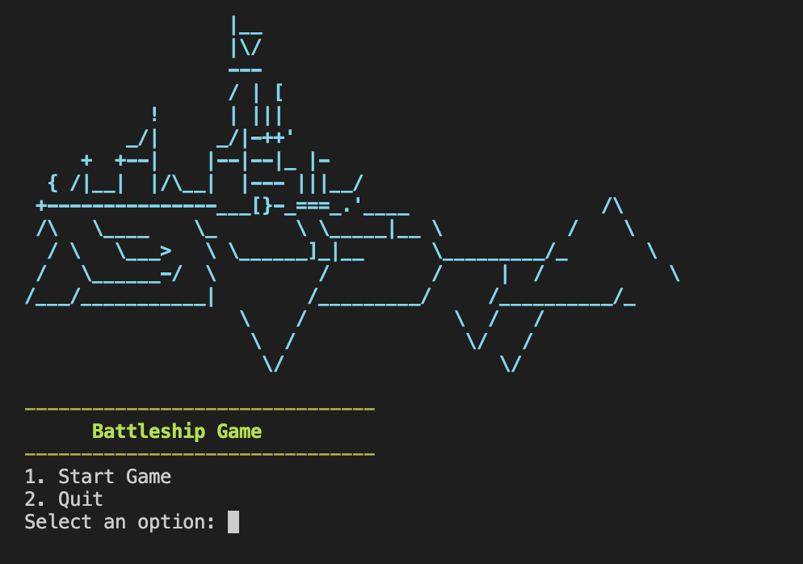

# The Battleship-Game

The Battleship game is a classic strategy game reimagined in a modern, command-line interface. This Python-based application offers a compelling mix of strategy, luck, and skill, inviting players to engage in a naval warfare simulation against an computer opponent.


 


## Table of Contents

1. [Demo](#demo)
2. [Technologies Used](#technologies-used)
3. [Game rules](#game-rules)
5. [Flowchart](#flowchart)
6. [Design Structure](#design-structure)
7. [Color Scheme](#color-scheme)
8. [Features](#features)
9. [Sources](#sources)
10. [Contact](#contact)

## Demo

The live demo of the game is in progress. https://thebluewolfofthenorth.github.io/Rock-Paper-Scissors-Lizard-Spock_Game/

## Technologies Used

 - Python
    Version: (Specify the version of Python used, e.g., Python 3.8)
    Description: Python is the core programming language used to develop the game's logic and structure. Its simplicity and readability make it ideal for creating clear and maintainable code.
- Colorama
    Usage: Colorama is a Python library that brings terminal text to life with color and style.
    Purpose: In this project, Colorama is used to enhance the command-line interface, making game messages more engaging and easier to distinguish through the use of colored output.

## Game rules

 - Overview
    Battleship is a strategic guessing game played between two players. In this version, you will compete against an computer opponent. The game is set on a grid-based sea where each player has a fleet of ships. The primary objective is to sink all the ships of your opponent before they sink yours.

 - Setting Up the Game
    1. Each player has an 8x8 grid representing the ocean.
    2. Players have a fleet of ships of varying sizes. In this version, you and the computer have 4 ships, each occupying 3 squares on the grid.
    3. At the beginning of the game, ships are placed in random locations on the grid, oriented either horizontally or vertically. The locations of the ships are hidden from the opponent.
- Gameplay
    1. Players take turns to call out row and column coordinates on the opponent's grid in an attempt to hit the opponent's ships.
    2. On your turn, you will enter coordinates (e.g., A5). The game will then inform you whether it was a "hit" or a "miss."
    3. When a ship is hit, it gets marked with an 'X' on the grid. A miss is marked with a '0'.
    4. The game continues in turns until all the ships of one player are completely hit, i.e., sunk.


## Flowchart
```plaintext
Battleship Game Flowchart
-------------------------

1. Start Game
   |
   v
2. Display Initial Menu (display_initial_menu)
   |
   v
3. Player Inputs Name (get_player_name)
   |
   v
4. Player Chooses Screen Clear Preference (get_player_preference)
   |
   v
5. Initialize Game Boards
   |-> Create Player Board (create_board)
   |-> Create Enemy Board (create_board)
   |-> Create Player Guess Board (create_guess_board)
   |
   v
6. Randomly Place Ships
   |-> Place Ships on Player Board (place_ships)
   |     |-> Check Ship Placement Validity (can_place_ship, is_valid_placement)
   |     |-> Set Ship on Board (set_ship)
   |
   |-> Place Ships on Enemy Board (place_ships)
         |-> Check Ship Placement Validity (can_place_ship, is_valid_placement)
         |-> Set Ship on Board (set_ship)
   |
   v
7. Begin Main Game Loop
   |
   +-> Player's Turn
   |     |
   |     |-> Input Coordinates (player_move)
   |     |-> Process Player's Guess (player_guess)
   |     |-> Update Player's Guess Board
   |     |
   |     |-> Check Win Condition (is_game_over)
   |           |
   |           Yes -> End Game
   |
   |-> Enemy's Turn
         |
         |-> Generate Enemy Guess (enemy_move)
         |     |-> Random Enemy Guess (random_enemy_guess)
         |     |-> Make Enemy Guess (make_enemy_guess)
         |
         |-> Update Enemy's Guess Board
         |
         |-> Check Win Condition (is_game_over)
               |
               Yes -> End Game
   |
   v
8. End Game
   |-> Display Result (Win/Loss)
   |-> Prompt to Play Again or Exit (prompt_for_restart)
   |
   v
9. Exit or Restart Game
```


## Design Structure
The game is structured to provide an interactive user experience:

- **Game Board and Interface**:
    -Grid-Based Layout: The game features an 8x8 grid, representing the ocean where ships are placed. This grid-based design is a core aspect of the traditional Battleship game and is effectively implemented in the command-line interface.

    - Visual Clarity: Utilizing the command-line interface, the game board is presented in a clear and structured format. Each cell in the grid is distinctly marked to reflect hits, misses, and ship locations, enhanced by the use of color coding through the Colorama library.

- **Game Architecture**:
    - Modular Function Design: The game's architecture is built with a focus on modular functions. Each key aspect of the game, such as board initialization, ship placement, and gameplay logic, is encapsulated in separate functions. This approach enhances readability and maintainability.

    - Command-Line Interface: The game runs entirely within a command-line environment, ensuring accessibility and ease of use. The interface is designed to be intuitive, allowing players to easily interact with the game using simple text commands.

- **Ship Placement and Management**:
    - Randomized Ship Placement: At the start of each game, ships are placed randomly on the board. This randomness is crucial for ensuring that each game is unique and challenging.

    - Ship Size and Orientation: Ships occupy a fixed number of contiguous squares on the grid, either horizontally or vertically. This design choice adds a layer of complexity and strategy to the game.

- **Gameplay Mechanics**:
    - Turn-Based Play: True to the original Battleship game, this version follows a turn-based system where the player and the AI opponent alternate turns. Each turn consists of choosing grid coordinates to target and attack.

    - Hit and Miss System: When a player guesses a coordinate, the game provides immediate feedback, indicating a hit or miss. This instant feedback is central to the gameplay experience, keeping players engaged and informed.


## Color Scheme
Battleship employs a vibrant color scheme to enhance your gaming experience. Each color has a specific purpose, making it easy to understand the game's state at a glance.

- Green: Green is primarily used for your board and friendly elements. When you see green, it's your territory.

- Yellow: Yellow is the color of your enemy's board and actions. When you encounter yellow, it's time to strategize against your opponent.

- Red: Red indicates hits, whether they are made by you or your enemy. When you see red, you know you've struck a target.

- Blue: Blue represents misses, signifying that a shot has gone astray.

- Magenta: Magenta is used for interactive prompts and important messages. Pay close attention to magenta text for guidance and decisions.


This color scheme adds clarity and excitement to the game, making Battleship an engaging and visually appealing experience.


## Features
### Exiting Features:
- **Start Game Option**:
    - To begin your Battleship adventure, select '1' in the main menu.
    - This option makes it easy to dive right into the action.

- **Random Ship Placement**: 
    - Implementing a random yet valid placement of ships was a challenge, addressed by developing functions (place_ships, can_place_ship) that ensure ships are placed within the bounds of the game board without overlapping.
- **User Input Validation**: 
    - The game rigorously validates user input for coordinates, ensuring that inputs are within the grid and have not been previously guessed, enhancing the game's robustness.

- **Game Introduction**:
    - Battleship is a classic board game where you'll challenge your strategic skills on an 8x8 grid.
    - The game features 4 ships, each with a length of 3 units.
    - You'll use coordinates to target enemy ships on the grid.
    - Ships are represented by 'S' on the board.

- **Clear Screen Option**:
    - Battleship offers you the choice to clear the screen automatically between turns.
    - If you prefer a clean slate after each move, type 'yes' when prompted.
    - If you'd rather keep the history of your moves visible, type 'no.'

- **Colors**:
    - I've added some color to the game to make it visually appealing and easy to follow.
    - Hits, misses, and ships are color-coded, so you'll always know the state of the game.

- **Dynamic Game Board Visualization**:
    - The game board is dynamically rendered within the command line, with distinct color-coding for different elements (hits, misses, ships) using the Colorama library. This enhances the player's ability to track the game's progress.

- **Exit Option**:
    - If you ever want to exit the game, simply type '2' in the main menu, and you'll gracefully exit Battleship.
    - It's your game, and you have control over when to start or quit.

- **Score Tracking**:
    - Battleship keeps track of your wins and losses.
    - After each game over, you'll see your score, including the number of wins and losses.
    - This feature adds a competitive edge to the game, motivating you to improve your strategy and aim for more victories.

### Future Features

 - **Scalability**: 
    - The game's design allows for potential scalability, such as introducing varying grid sizes, more ship types, or advanced computer difficulty levels.

- **Multiplayer Feature**: 
    - Future versions could include a multiplayer option, allowing two players to compete against each other.


## Testing

I used the <a href="https://pep8ci.herokuapp.com/#">PEP3</a> where I got no mayor erros, all of them where about line to long but those are part of my code so I wasnt sure what it mean 

[Screenshot of test](./img/PEP3-test.png) 

because of that I use also <a href="https://extendsclass.com/python-tester.html">Python-tester</a> to check if the code was working as it should. 
no errrors where rapported there
[Screenshot of test](./img/rython-test.png) 


#### Unresolved Bugs:
In VSC I was getting a minor error on colorama
- **Import "colorama" could not be resolved from source**
I try to reinstall but it seems that it never work.


## Deployment 

This site was depolyed to GitHub pages. The steps to deploy a site are shown below:

1. In the GitHub Repository called <b>battleship-game</b> click on the <b>Settings</b> button on the Repoitory navigation menu.

2. In <b>Settings</b> on the left side, go down to the <b>Pages</b> item and click on it.

3. Make sure the <b>Source</b> item is set to: <b>Deploy from a branch</b>

4. at the <b>Branch</b> item underneth the <b>source</b> item, set the branch to main and save it.

5. Once you have selected the main branch, the page will automatically refresh to show a detailed ribbon display indicating that the deployment was successful.

To get to the live link of the GitHub repository - click here: <a href="https://thebluewolfofthenorth.github.io/yoga-mindfullnes-app/">The Battleship Game
</a>


#### To create a local clone of this project:

1. Click the Code tab under the repository's name.
2. Click the clipboard icon in the Clone with HTTPS section to copy the URL.


Once you have copied the URL, you can use a Git client to clone the repository to your local computer.
Here are the steps to clone a repository using Git Bash:

3. Open Git Bash.
4. Navigate to the directory where you want to clone the repository.
5. Type the following command and press Enter:

git clone <URL>

Replace <URL> with the URL of the repository that you copied in step 2.

This will create a local clone of the repository in the current directory.

You also can create and name the directory where the clone should be saved in, with adding the directory name after the <URL>. So the full command would look like this: git clone <URl> XXXX(This is a directory name)


## Credits

   ### Code: 
  
  - The Battleship Game was inspiered by  <a href="https://www.sourcecodester.com/python/15752/simple-battleship-gamevs-ai-python-free-source-code.html?utm_content=cmp-true">razormist</a>

- This project was build with using a template from <a href="https://github.com/Code-Institute-Org/p3-template">Codeinsitute</a> to create the neccessery enviorment for deploying to Heroku. 


   ## Acknowledgements:

   thanks to my mentor Ronan to help me along to the completion of this project

   - I chose to build a simple game with the intention of keeping it straightforward and saving time to incorporate more dynamics and animations. However, this didn't quite work out as planned. I encountered minor issues, like z-index problems, which caused significant challenges and took a long time to diagnose and resolve. In the end, I was quite satisfied with the game's functionality, especially the JavaScript aspects. The design could have been better, but with more time and if this were a full-time job, I believe I could have created something truly impressive.


## note:

- I spend a lot of time learning about simple structure ideas not covered in the course, requiring extensive reading from w3schools on the basics. All of my code is self-created. It was disappointing to see my game fail the Lighthouse test on desktop due to several issues I wasn't aware of. It's possible to fix these, but I'll need more time to work on it and to further my understanding of the underlying concepts.